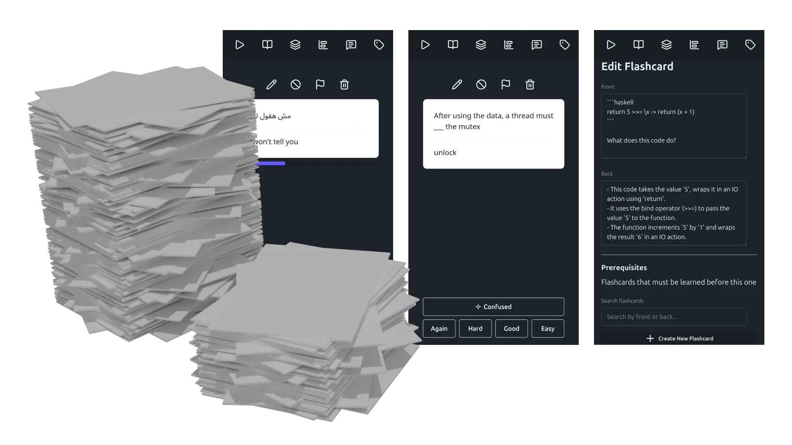

# Karten



**State-of-the-art Spaced Repetition in the web, with experimental features such as interconnected flashcards and verbatim memorization tools**

### [Free Online App](https://karten.koljasam.com/)

## Tech Stack

- Vue 3 with `<script setup>` SFCs
- TypeScript
- Vite
- Tailwind CSS + DaisyUI
- Vue Router
- ESLint 9 (flat config)

## Development

```bash
# Install dependencies
npm install

# Run dev server
npm run dev

# Build for production
npm run build

# Preview production build
npm run preview

# Lint code
npm run lint

# Fix linting issues
npm run lint:fix

# Regenerate doc diagrams (from doc/*.md mermaid blocks → PNG)
npm run docs:diagrams
```

> **Note on `docs:diagrams`:** uses `puppeteer-config.json` (sets `--no-sandbox`) to run headless Chromium on Linux. If you hit sandbox errors, ensure the file exists at the repo root.

## Architecture

See also [the developer guidelines](developer-guidelines.md) for detailed architecture and design guidelines.
