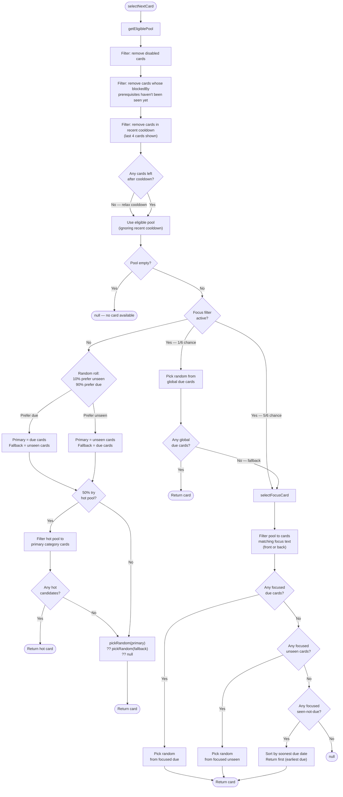

# Card Selection Logic

```mermaid
flowchart TD
    START([selectNextCard]) --> POOL[getEligiblePool]

    POOL --> P1["Filter: remove disabled cards"]
    P1 --> P2["Filter: remove cards whose blockedBy\nprerequisites haven't been seen yet"]
    P2 --> P3["Filter: remove cards in recent cooldown\n(last 4 cards shown)"]
    P3 --> P4{"Any cards left\nafter cooldown?"}
    P4 -->|No — relax cooldown| ELIGIBLE["Use eligible pool\n(ignoring recent cooldown)"]
    P4 -->|Yes| ELIGIBLE

    ELIGIBLE --> EMPTY{"Pool empty?"}
    EMPTY -->|Yes| NULL([null — no card available])
    EMPTY -->|No| FOCUS{"Focus filter\nactive?"}

    FOCUS -->|Yes — 5/6 chance| SF[selectFocusCard]
    FOCUS -->|Yes — 1/6 chance| GLOBAL["Pick random from\nglobal due cards"]
    GLOBAL --> GFALLBACK{"Any global\ndue cards?"}
    GFALLBACK -->|Yes| DONE([Return card])
    GFALLBACK -->|No — fallback| SF

    FOCUS -->|No| COIN{"Random roll:\n10% prefer unseen\n90% prefer due"}
    COIN -->|Prefer due| DUE_FIRST["Primary = due cards\nFallback = unseen cards"]
    COIN -->|Prefer unseen| UNSEEN_FIRST["Primary = unseen cards\nFallback = due cards"]
    DUE_FIRST --> HOT{"50% try\nhot pool?"}
    UNSEEN_FIRST --> HOT
    HOT -->|Yes| HOTFILT["Filter hot pool to\nprimary category cards"]
    HOTFILT --> HOTFOUND{"Any hot\ncandidates?"}
    HOTFOUND -->|Yes| DONE_HOT([Return hot card])
    HOTFOUND -->|No| PICK["pickRandom(primary)\n?? pickRandom(fallback)\n?? null"]
    HOT -->|No| PICK
    PICK --> DONE2([Return card])

    SF --> SF1["Filter pool to cards\nmatching focus text\n(front or back)"]
    SF1 --> SF2{"Any focused\ndue cards?"}
    SF2 -->|Yes| SF_DUE["Pick random\nfrom focused due"]
    SF2 -->|No| SF3{"Any focused\nunseen cards?"}
    SF3 -->|Yes| SF_UNSEEN["Pick random\nfrom focused unseen"]
    SF3 -->|No| SF4{"Any focused\nseen-not-due?"}
    SF4 -->|Yes| SF_SORT["Sort by soonest due date\nReturn first (earliest due)"]
    SF4 -->|No| SF_NULL([null])
    SF_DUE --> DONE3([Return card])
    SF_UNSEEN --> DONE3
    SF_SORT --> DONE3
```
